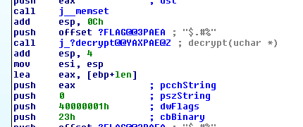
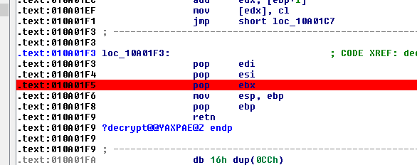
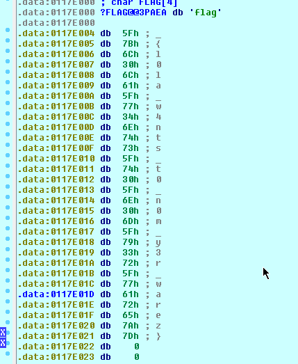

# 500 Malrio Ware

> Malware isn't good for your computer

> For Muffins' dear dog L0la, she has a ruff life

> malrio_ware_181ef8c6c5b667964d6be9f5fc7c404ebc5319e5.zip

I did the stupid thing and ran the program. It put itself into my startup folder and displayed lola every 10 seconds or whatever it is.

Wandering around lola.exe was even worse than wandering around Middle Earth. In the main function there was one noteworthy function called beacon.

Because inside this function, the function `decrypt` is called, with the flag as its argument.

Using IDA, I generated some pseudo-C code that makes understanding the function a lot easier.

Looks like it takes the flag and XORs each character by `0x42`. Simple enough. Where's the flag? Well, we could dig around the binary and look for how it's constructed, or we could just run it and then break it where the decrypt function is called, and look at the memory. Let's break at the end of the decrypt function, right before it's closed.

I know this is dangerous, but let's run it on the local Win32 debugger. The breakpoint causes the program execution to stop right after it's decrypted the whole string, but before it returned. So the decrypted flag should still be in memory.

## Flag

`flag_{l0la_w4nts_t0_n0m_y3r_warez}`